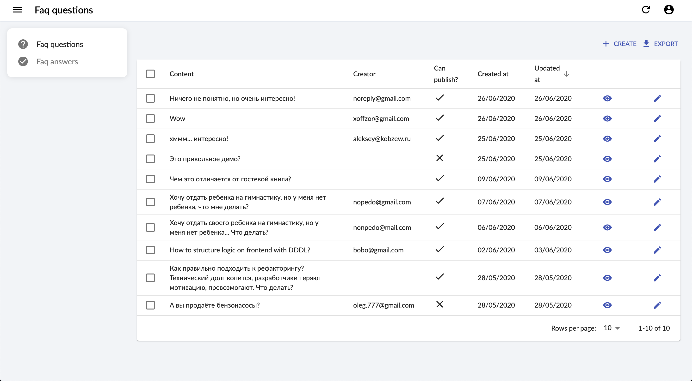

# Headless FAQ admin panel

Admin panel for Headless FAQ

# Setup

## Dev

1. This is simple `React Admin` (`React Create App`), so you can find all instructions
on https://github.com/marmelab/react-admin
1. `npm run start`

## Deploy

1. It's better to use [Vercel](https://vercel.com/) for such task and just `git push`

# Techs

1. GraphQL (Apollo)
1. React Create App
1. React Admin (+ Material UI)
1. React Hook Form
1. TypeScript
1. RA Data Hasura Graphql